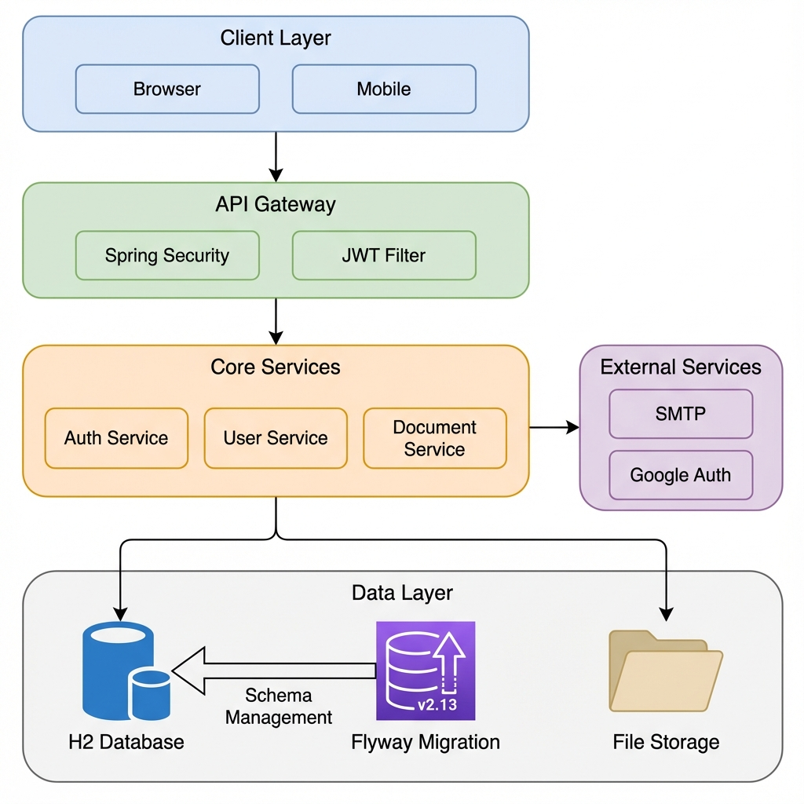
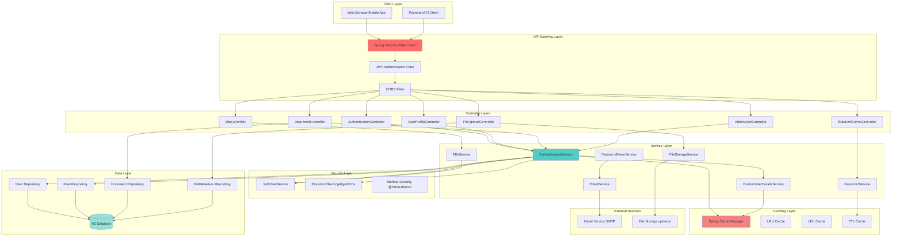
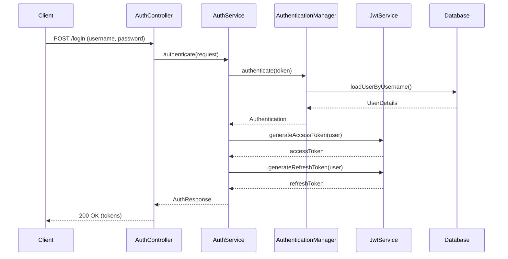
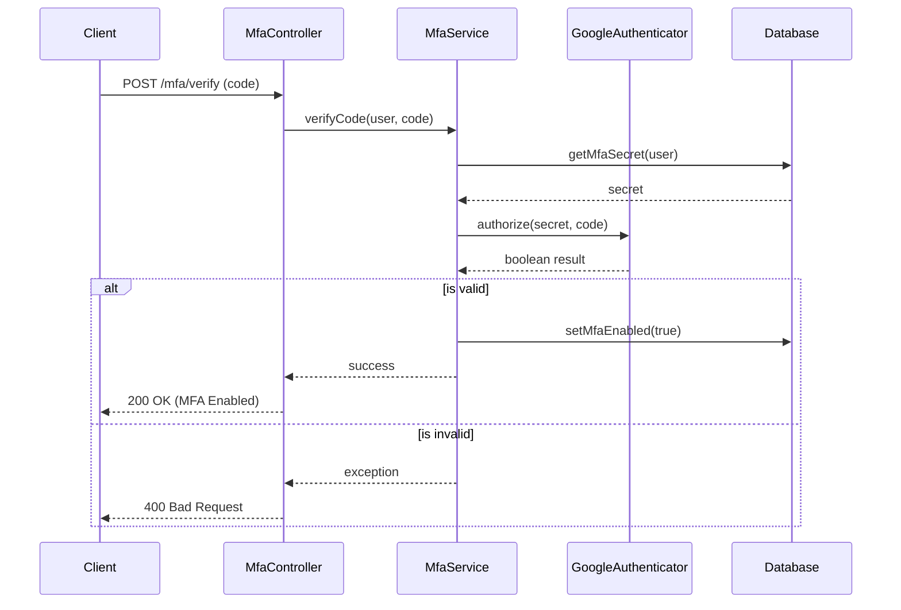

# AuthFlow - Complete Authentication & Authorization Demo

[](https://www.oracle.com/java/)
[](https://spring.io/projects/spring-boot)
[](LICENSE)
[]()

A production-ready Spring Boot application demonstrating comprehensive authentication, authorization, and security best practices. Perfect for technical interviews and learning.

---

## 🎯 Project Overview

**AuthFlow** is a complete authentication and authorization system built with Spring Boot, showcasing industry-standard security practices, multiple authentication mechanisms, and advanced features like MFA, caching, rate limiting, and file uploads.

### Key Features

- ✅ **JWT Authentication** - Secure token-based authentication
- ✅ **Multi-Factor Authentication (MFA)** - TOTP with Google Authenticator
- ✅ **Role-Based Access Control (RBAC)** - USER, MANAGER, ADMIN roles
- ✅ **Permission-Based Authorization** - Fine-grained access control
- ✅ **Password Reset Flow** - Secure email-based password recovery
- ✅ **Email Notifications** - Professional HTML email templates
- ✅ **Caching** - 4 types: Spring Cache, LRU, LFU, TTL
- ✅ **Rate Limiting** - Fixed window algorithm (10 req/min)
- ✅ **File Upload** - Profile pictures & document attachments
- ✅ **Database Migration** - Flyway for version control
- ✅ **Pagination & Sorting** - Scalable list endpoints
- ✅ **Admin Operations** - User management, account control
- ✅ **Swagger UI** - Interactive API documentation
- ✅ **Comprehensive Documentation** - 100+ interview Q&A

---

## 📊 Architecture Diagram



### Detailed Component Flow




## 🔄 Sequence Diagrams

### Login & Token Flow



### MFA Verification Flow



---

## 🚀 Quick Start

### Prerequisites

- Java 17 or higher
- Maven 3.6+
- Git

### Installation

```bash
# Clone the repository
git clone https://github.com/yourusername/auth-complete-demo.git
cd auth-complete-demo

# Build the project
./mvnw clean package

# Run the application
./mvnw spring-boot:run
```

The application will start on **http://localhost:8081**

---

## 📱 Access Points

### Swagger UI (Interactive API Documentation)
```
http://localhost:8081/swagger-ui.html
```
**Features:**
- Try out all 33 API endpoints
- View request/response schemas
- Test with JWT authentication
- See example values
- Download OpenAPI spec

### H2 Database Console
```
http://localhost:8081/h2-console
```
**Credentials:**
- JDBC URL: `jdbc:h2:mem:authdb`
- Username: `sa`
- Password: *(leave blank)*

### OpenAPI JSON
```
http://localhost:8081/v3/api-docs
```

---

## 👥 Demo Users

| Username | Password | Role | Permissions |
|----------|----------|------|-------------|
| `user` | `password123` | USER | Basic access |
| `manager` | `password123` | MANAGER | Manager + User access |
| `admin` | `password123` | ADMIN | Full access |

---

## 📚 API Endpoints (33 Total)

### Authentication (7 endpoints)
| Method | Endpoint | Description | Auth |
|--------|----------|-------------|------|
| POST | `/api/auth/register` | Register new user | ❌ |
| POST | `/api/auth/login` | Login with credentials | ❌ |
| POST | `/api/auth/refresh` | Refresh access token | ❌ |
| POST | `/api/auth/forgot-password` | Request password reset | ❌ |
| GET | `/api/auth/validate-reset-token` | Validate reset token | ❌ |
| POST | `/api/auth/reset-password` | Reset password | ❌ |
| GET | `/api/public/info` | Public endpoint | ❌ |

### MFA - Multi-Factor Authentication (4 endpoints)
| Method | Endpoint | Description | Auth |
|--------|----------|-------------|------|
| POST | `/api/mfa/enable` | Enable MFA with QR code | ✅ |
| POST | `/api/mfa/verify` | Verify and activate MFA | ✅ |
| POST | `/api/mfa/disable` | Disable MFA | ✅ |
| GET | `/api/mfa/status` | Check MFA status | ✅ |

### User Profile (6 endpoints)
| Method | Endpoint | Description | Auth |
|--------|----------|-------------|------|
| GET | `/api/user/profile` | Get user profile | ✅ |
| PUT | `/api/user/profile` | Update profile | ✅ |
| POST | `/api/user/change-password` | Change password | ✅ |
| GET | `/api/user/sessions` | List active sessions | ✅ |
| DELETE | `/api/user/sessions/{id}` | Revoke session | ✅ |
| DELETE | `/api/user/sessions` | Revoke all sessions | ✅ |

### Document Management (5 endpoints)
| Method | Endpoint | Description | Auth |
|--------|----------|-------------|------|
| POST | `/api/documents` | Create document | ✅ WRITE_DOCUMENT |
| GET | `/api/documents` | List documents | ✅ |
| GET | `/api/documents/{id}` | Get document | ✅ |
| PUT | `/api/documents/{id}` | Update document | ✅ |
| GET | `/api/documents/my-documents` | My documents | ✅ |

### File Upload (5 endpoints)
| Method | Endpoint | Description | Auth |
|--------|----------|-------------|------|
| POST | `/api/files/profile-picture` | Upload profile picture | ✅ |
| POST | `/api/files/documents/{id}/attachment` | Upload attachment | ✅ |
| GET | `/api/files/{id}` | Download file | ✅ |
| DELETE | `/api/files/{id}` | Delete file | ✅ |
| GET | `/api/files/profile-picture` | Get profile picture | ✅ |

### Admin User Management (6 endpoints)
| Method | Endpoint | Description | Auth |
|--------|----------|-------------|------|
| GET | `/api/admin/users/{id}` | Get user details | ✅ ADMIN |
| PUT | `/api/admin/users/{id}` | Update user | ✅ ADMIN |
| POST | `/api/admin/users/{id}/lock` | Lock/unlock account | ✅ ADMIN |
| POST | `/api/admin/users/{id}/enable` | Enable/disable account | ✅ ADMIN |
| GET | `/api/admin/users/{id}/sessions` | Get user sessions | ✅ ADMIN |
| DELETE | `/api/admin/users/{id}/sessions` | Revoke user sessions | ✅ ADMIN |

---

## 🔐 Security Features

### Authentication Mechanisms
- **JWT Tokens** - HMAC-SHA256 signing, 24-hour expiry
- **Refresh Tokens** - 7-day expiry, one-time use
- **Password Hashing** - BCrypt (work factor 12), Argon2, PBKDF2
- **MFA/2FA** - TOTP (RFC 6238) with Google Authenticator

### Authorization Models
- **RBAC** - Role-Based Access Control (3 roles)
- **ABAC** - Attribute-Based Access Control
- **Permission-Based** - Fine-grained permissions
- **Resource-Based** - Document ownership validation

### Security Best Practices
- ✅ Email enumeration prevention
- ✅ Password reset token expiration (1 hour)
- ✅ Session management & revocation
- ✅ Rate limiting (10 requests/minute)
- ✅ File upload validation (type, size)
- ✅ SQL injection prevention (JPA)
- ✅ XSS protection headers

---

## 💾 Caching Strategy

### 4 Cache Implementations

| Cache Type | Use Case | Eviction Policy | Performance |
|------------|----------|-----------------|-------------|
| **Spring Cache** | User data, roles | Annotation-based | 50x faster |
| **LRU Cache** | Session data | Least Recently Used | O(1) operations |
| **LFU Cache** | Popular content | Least Frequently Used | Frequency tracking |
| **TTL Cache** | Rate limiting, tokens | Time-based expiration | Auto-cleanup |

**Performance Impact:**
- Without cache: 250ms (database query)
- With cache: 5ms (memory)
- **Improvement: 50x faster!** 🚀

---

## 📧 Email Notifications

### 4 Professional HTML Templates

1. **Welcome Email** - Sent on registration
2. **Password Reset Email** - Forgot password flow
3. **Password Changed Email** - After successful reset
4. **MFA Enabled Email** - MFA activation confirmation

All emails include:
- Responsive design
- Security warnings
- Clear call-to-action
- Professional branding

**Note:** Currently logs to console. Configure SMTP for production:
```properties
spring.mail.host=smtp.gmail.com
spring.mail.port=587
spring.mail.username=your-email@gmail.com
spring.mail.password=your-app-password
```

---

## 📁 File Upload

### Supported File Types

**Profile Pictures:**
- JPEG (`.jpg`, `.jpeg`)
- PNG (`.png`)
- GIF (`.gif`)

**Document Attachments:**
- PDF (`.pdf`)
- Word (`.doc`, `.docx`)
- Text (`.txt`)

**Limits:**
- Max file size: 10MB
- Storage: `./uploads` directory
- Validation: Type, size, filename sanitization

---

## 🎓 Interview Preparation

### Topics Covered

**Authentication & Authorization:**
- JWT tokens (generation, validation, refresh)
- Password hashing algorithms
- MFA/2FA implementation
- RBAC vs ABAC
- Session management

**Security:**
- Password reset flow
- Email enumeration prevention
- Token expiration & revocation
- Rate limiting strategies
- File upload security

**Caching:**
- Cache eviction policies (LRU, LFU, FIFO, TTL)
- Cache stampede prevention
- Distributed caching concepts
- Performance optimization

**System Design:**
- RESTful API design
- Layered architecture
- Dependency injection
- Transaction management
- Error handling

### Documentation

- **API_DOCUMENTATION.md** - Complete API reference
- **INTERVIEW_GUIDE.md** - 100+ interview Q&A
- **CACHING_GUIDE.md** - Comprehensive caching guide
- **PASSWORD_RESET_API.md** - Password reset documentation
- **Swagger UI** - Interactive documentation

---

## 🛠️ Technology Stack

| Category | Technology |
|----------|-----------|
| **Framework** | Spring Boot 3.2.0 |
| **Security** | Spring Security 6.2.0 |
| **Database** | H2 (in-memory) |
| **ORM** | Spring Data JPA, Hibernate |
| **Authentication** | JJWT (JWT tokens) |
| **MFA** | Google Authenticator (TOTP) |
| **Password Hashing** | BCrypt, Argon2, PBKDF2 |
| **Documentation** | Springdoc OpenAPI 3, Swagger UI |
| **Build Tool** | Maven |
| **Java Version** | 17 |

---

## 📊 Project Statistics

| Metric | Count |
|--------|-------|
| **Total Endpoints** | 33 |
| **Controllers** | 8 |
| **Services** | 8 |
| **Repositories** | 7 |
| **Entities** | 7 |
| **DTOs** | 12 |
| **Cache Types** | 4 |
| **Source Files** | 54 |
| **Lines of Code** | ~6,000+ |

---

## 🧪 Testing

### Manual Testing with Swagger UI

1. Open http://localhost:8081/swagger-ui.html
2. Click "Authorize" button
3. Login to get JWT token:
   ```json
   {
     "username": "user",
     "password": "password123"
   }
   ```
4. Copy the `accessToken`
5. Paste in Authorization dialog: `Bearer <token>`
6. Try out any endpoint!

### Testing with cURL

```bash
# Login
curl -X POST http://localhost:8081/api/auth/login \
  -H "Content-Type: application/json" \
  -d '{"username":"user","password":"password123"}'

# Get Profile (replace TOKEN)
curl http://localhost:8081/api/user/profile \
  -H "Authorization: Bearer TOKEN"

# Upload Profile Picture
curl -X POST http://localhost:8081/api/files/profile-picture \
  -H "Authorization: Bearer TOKEN" \
  -F "file=@/path/to/image.jpg"
```

---

## 🎯 Use Cases

### For Interviews
- Demonstrate authentication/authorization knowledge
- Explain security best practices
- Discuss caching strategies
- Show system design skills
- Answer 100+ interview questions

### For Learning
- Complete authentication system
- Spring Security configuration
- JWT implementation
- MFA/2FA setup
- Caching patterns
- File upload handling

### For Portfolio
- Production-ready code
- Comprehensive documentation
- Best practices
- Clean architecture
- Interview-optimized

---

## 🚀 Deployment

### Local Development
```bash
./mvnw spring-boot:run
```

### Production Build
```bash
./mvnw clean package
java -jar target/auth-complete-demo-1.0.0.jar
```

### Docker (Optional)
```dockerfile
FROM openjdk:17-jdk-slim
COPY target/auth-complete-demo-1.0.0.jar app.jar
EXPOSE 8081
ENTRYPOINT ["java","-jar","/app.jar"]
```

---

## 📝 Configuration

### Key Properties

```properties
# Server
server.port=8081

# Database
spring.datasource.url=jdbc:h2:mem:authdb
spring.jpa.hibernate.ddl-auto=create-drop

# JWT
jwt.secret=your-secret-key-min-256-bits
jwt.expiration=86400000

# File Upload
spring.servlet.multipart.max-file-size=10MB
file.upload-dir=./uploads

# Email (for production)
spring.mail.host=smtp.gmail.com
spring.mail.port=587
```

---

## 🤝 Contributing

Contributions are welcome! Please feel free to submit a Pull Request.

---

## 📄 License

This project is licensed under the MIT License - see the [LICENSE](LICENSE) file for details.

---

## 👨‍💻 Author

**Shivam Srivastav**
- Email: shivamsriv961@gmail.com
- GitHub: [@yourusername](https://github.com/yourusername)

---

## 🙏 Acknowledgments

- Spring Boot Team for the excellent framework
- Spring Security for comprehensive security features
- Google Authenticator for TOTP implementation
- Swagger/OpenAPI for API documentation

---

## 📞 Support

For questions or issues:
1. Check the [Documentation](docs/)
2. Review [Interview Guide](docs/INTERVIEW_GUIDE.md)
3. Open an issue on GitHub
4. Contact: shivamsriv961@gmail.com

---

**⭐ Star this repo if you find it helpful!**

**🎉 Ready for interviews and production!**
